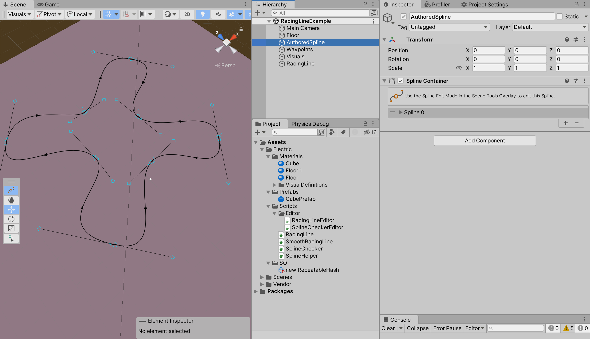
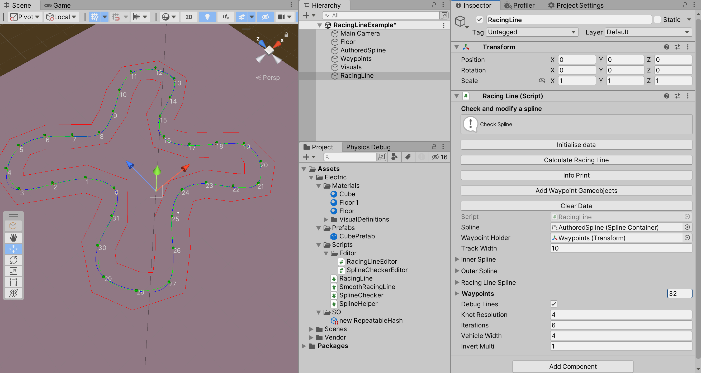
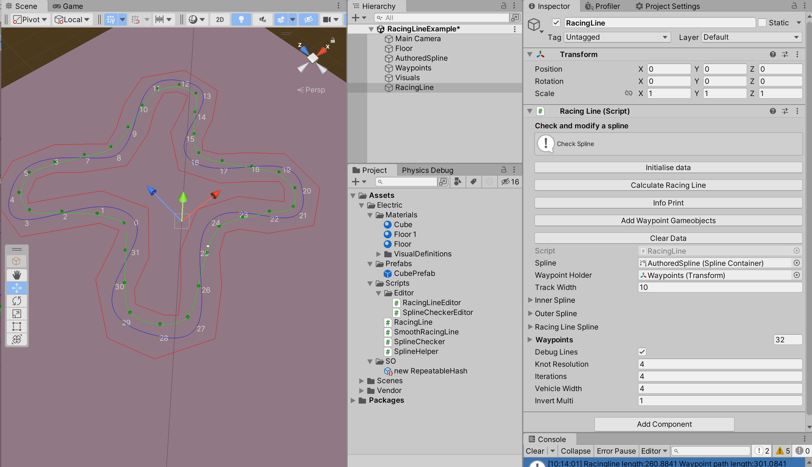
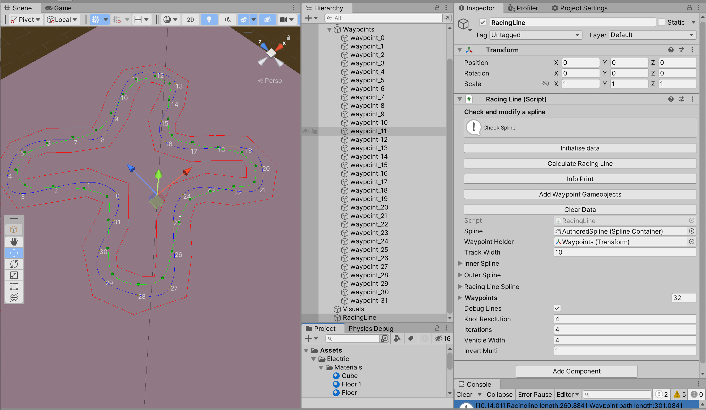

## Racing Line 
This is an old school racing line calculation by [Remi Coulom](https://github.com/Remi-Coulom), I'm sure it could be rewritten neatly using Vector2s.. one day I'll have time for that stuff!

Orignal is from  [https://rars.sourceforge.net/](https://rars.sourceforge.net/)

Then reused in TORCS [https://torcs.sourceforge.net/](https://torcs.sourceforge.net/), [https://en.wikipedia.org/wiki/TORCS](https://en.wikipedia.org/wiki/TORCS) and this version is ported from VDrift [https://github.com/VDrift/vdrift/](https://github.com/VDrift/vdrift/)

# How to
**Caveat:** The debug draw has quite a lag on it to refresh when the data changes, toggling something in the inspector (like opening up the waypoints array and closing it again) gets it to update - otherwise it seems like clicking hte buttons and nothing is happening!

## Step 1:
Add race track Unity spline (this is essentially the mid point of the track as a spline - I generate my tracks from this spline, you might too..)

## Step 2: 
Add in the racing line script to the scene, drag in the track spline and waypoint parent. 

#### Change the settings:   

**Track width:** you size (is visualises the inner and outer splines at low res in red)   
**Knot resolution:** this is the reolution of how many knots and waypoints you'll generate
**Iterations:** The racing line is generated by smoothing out the spline, this ios how many smoothing iterations it makes. 3 or 4 works well 5 or more generally gets worse or diminishing returns

## Step 3: 
Click  
**Initialise Data**: this generates the working data  
**Calculate Racing Line**: this genertates the racing line   

## Setp 4: 
Once you';'re happy with how the racing line looks click  
**Add Waypoint GameObjects**: adds in empties ready for the (standard assets) waypoint ai car controller

## Notes
You need Unity's [Spline Package](https://docs.unity3d.com/Packages/com.unity.splines@2.2/manual/index.html) for this code / workflow to work.

There's a spline helper function that uses Largest Interior Rectangle is from https://github.com/Evryway/lir

